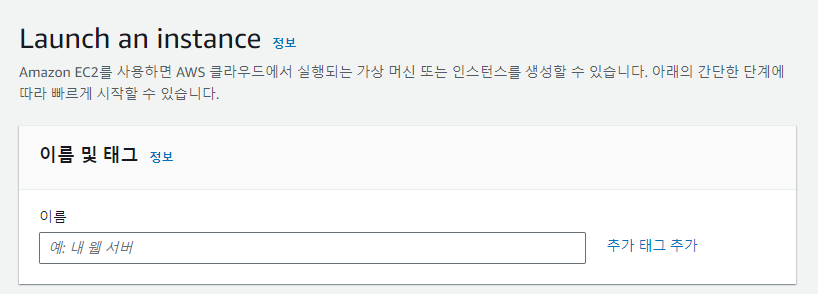

# Jitsi Server Setting

## With AWS
### 탄력적 IP 생성
#### 탄력적 IP 생성

- 탄력적 IP 주소 할당 클릭

#### 탄력적 IP 주소 설정

- 적절한 네트워크 경계 그룹 설정
    - 가급적이면 ec2를 생성할 지역과 같은 곳 설정

### 보안 그룹 설정
#### 보안 그룹 생성 클릭


#### 기본 세부 정보 설정

- 보안 그룹 이름 설정 (ex. JitsiFW)
- 설명 추가 (ex. Jitsi server Fire Wall)

#### 인바운드 규칙 생성

- Jitsi에서 사용하는 포트 규칙 생성
    - [참고 링크](https://jitsi.github.io/handbook/docs/devops-guide/devops-guide-quickstart#setup-and-configure-your-firewall)
- 예시
    

### 인스턴스 생성
#### 인스턴스 시작 클릭


#### 인스턴스 이름 설정

- ex) `Jitsi-server`

#### OS 이미지 설정

- Ubuntu 22.04`(권장)` 또는 Debian 10(Buster) 이상 선택

#### 인스턴스 유형 설정

- [참고 링크](https://jitsi.github.io/handbook/docs/devops-guide/devops-guide-requirements)
- RAM: 8GB 권장, 소규모 회의의 경우 <= 4GB
- CPU: 4 Core 이상 권장
- Disk: 20GB 이상 권장
- 해당 프로젝트에서는 `t2.medium` 사용

#### 키 페어 생성

- 기존의 키 페어가 있을 경우 사용 또는 `새 키 페어 생성` 클릭하여 생성

#### 네트워크 설정

- 앞서 생성해둔 보안그룹 선택
    - ex) `JitsiFW`

#### 스토리지 구성

- 위에 인스턴스 유형 설정 참고
- 해당 프로젝트에서는 해당 사진 사용

#### 인스턴스 시작

- 인스턴스 시작 버튼 클릭

### 인스턴스 연결
#### 인스턴스에 탄력적 IP 연결

- 앞서 만들어둔 탄력적 IP를 선택한 후 연결


- 앞서 만들어둔 인스턴스 선택 (ex. `i-~~~~~`)
- 해당 인스턴스의 프라이빗 ip 입력 (ex. `172.xx.xx.xx`)
- 연결 버튼 클릭
- 연결 완료 후 해당 인스턴스의 퍼블릭 ip가 변경되었는지 확인

#### 인스턴스 연결
- 해당 인스턴스를 선택 후 연결 버튼 클릭

- ssh 클라이언트를 선택하여 해당 코드 복사
- 터미널을 열어 앞서 생성한 키 페어가 있는 곳으로 이동 후 붙여넣기
    ```shell
    ssh -i "${YOUR-PEM-FILE-PATH}" ubuntu@${YOUR-PUBLIC-DNS}"
    ```

### Jitsi 설정
- 인스턴스 연결 후 jitsi setup 스크립트 다운로드
```shell
curl -L -O https://github.com/pellto/jitsi-proj/raw/main/jitsi/setup.sh
```

- 해당 스크립트 편집
    - ${YOUR-DOMAIN}: Jitsi 미팅을 서비스할 도메인으로 변경
    - ${YOUR-IP}: 해당 인스턴스의 퍼블릭 IP 입력

- 스크립트 실행 권한 부여
```shell
chmod +x ./setup.sh
```

- 스크립트 실행
```shell
./setup.sh
```
- 중간에 나오는 응답 확인

### Jitsi SSL 인증서 설치 with Let's Encrypt
- 도메인 입력 (ex. meet.example.com)


- Let's Encrypt를 사용하여 SSL 인증서 설치


- Jitsi 이메일 설정


- 서비스 데몬 재시작


### Jitsi 연결 확인
- 위에서 입력한 도메인(ex. meet.example.com)에 접속하여 jitsi 연결이 되었는지 확인